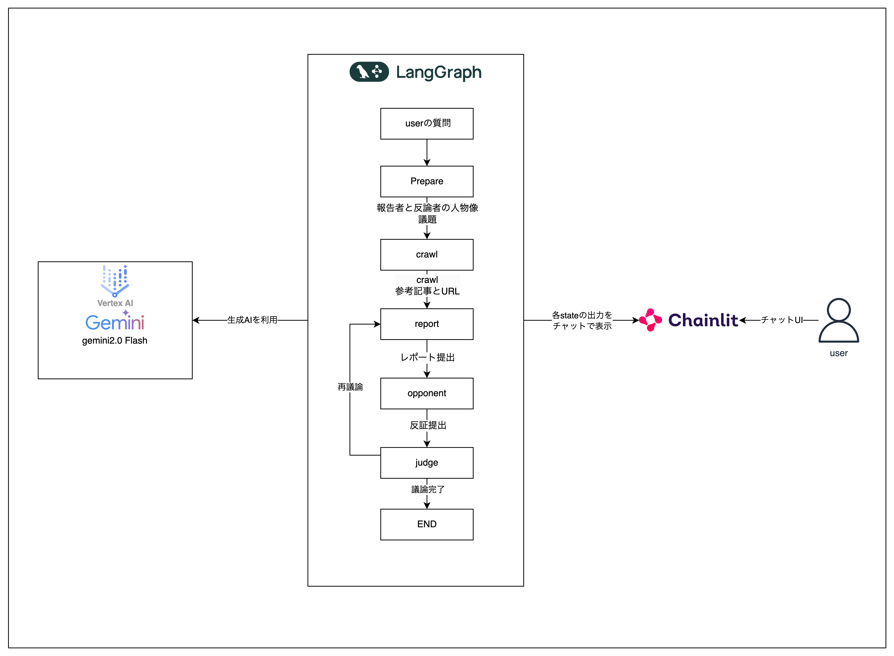

# debater
多角的視点から議論するAIエージェントサービス

# Requirement

* VSCode
* docker
* GCPカウントと権限を持ったIAMユーザー
* GoogleAIStudioのgemini APIキー
* TavilyのAPIキー
* ドメイン

# Installation
## ローカル起動
- 当リポジトリをcloneまたはforkし、VSCodeで起動する。
- devcontainerを起動する。（dockerが起動している必要がある）
- (パスワード認証が必要な場合)chainlit create-secretでsecretを取得し、.envのCHAINLIT_AUTH_SECRETに記載

## GCP上にデプロイ
- gcloudをインストールする（zshのため、zshrcに変更が必要。https://qiita.com/Y-Fujikawa/items/2c468eb85f3dec52c374）
```
curl https://sdk.cloud.google.com | bash
```
- 必要な権限を持ったGCPアカウントのIAMユーザーのクレデンシャルを、/credentialsに保存します。
- GCPのマネコンから、以下のアーキテクチャに必要なリソースをデプロイします。

# Usage
## ローカル起動
- 以下のコマンドでlocalhost:8000でchainlitが起動します
```
  make serve-local
```
- 以下のコマンドで、ビルドしたdocker imageを起動させることができます。

## dockerのデプロイ
- 以下コマンドでdockerイメージをGCPにpushできます。
```
  make docker-push
```

# architecture
GCPのアーキテクチャ


論理構成

